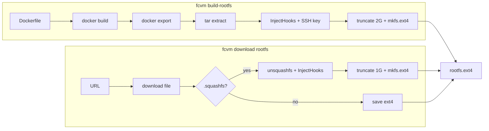

# Building the rootfs

This guide explains how to produce an ext4 rootfs image for fcvm and Firecracker microVMs.

The default output path is `~/.fcvm/images/rootfs.ext4`. Override it with `--output`, the `rootfs` key in your config file ([fcvm.example.yaml](fcvm.example.yaml)), or the `FCVM_ROOTFS` environment variable.

Build fcvm first:

```bash
go build -buildvcs=false -o fcvm .
```

See [README.md](README.md#build) for the full application build and quick-start guide.

## Overview

fcvm supports two ways to obtain a template rootfs:

| Method | Command | Use when |
|--------|---------|----------|
| **Custom build** | `fcvm build-rootfs --dockerfile <path>` | You need a workload-specific image built from a Dockerfile |
| **Download** | `fcvm download rootfs --url <url>` | You want a pre-built image from Firecracker CI or another URL |



The template image is shared across VMs. On `fcvm start`, fcvm copies it to `~/.fcvm/vms/<id>/rootfs.ext4` and re-patches it with the host SSH public key before boot.

## Prerequisites

### Host tools

| Tool | Package (Debian/Ubuntu) | Required for |
|------|-------------------------|--------------|
| `docker` | Docker Engine | `build-rootfs` |
| `mkfs.ext4`, `truncate` | `e2fsprogs` | both paths |
| `unsquashfs` | `squashfs-tools` | `download rootfs` (squashfs URLs) |
| `tar` | `tar` | `build-rootfs` export extraction |

`fcvm build-rootfs` does not require root. `fcvm download rootfs` and VM operations (`fcvm start`, etc.) may require root depending on your setup.

Ensure the Docker daemon is running before building:

```bash
sudo systemctl start docker
```

## Build a custom rootfs (recommended)

Use `fcvm build-rootfs` to build a Docker image from your Dockerfile, export its filesystem, inject fcvm boot hooks, and write an ext4 image.

### Basic usage

```bash
./fcvm build-rootfs --dockerfile path/to/Dockerfile
```

With explicit tag and output:

```bash
./fcvm build-rootfs \
  --dockerfile path/to/Dockerfile \
  --tag my-rootfs:v1 \
  --output ~/.fcvm/images/rootfs.ext4
```

### Flags

| Flag | Default | Description |
|------|---------|-------------|
| `--dockerfile` | *(required)* | Path to Dockerfile; build context is the Dockerfile's directory |
| `--tag` | `fcvm-rootfs:latest` | Docker image tag for the intermediate image |
| `--output` | config `rootfs` | Destination ext4 path |

### Build pipeline

Internally, `build-rootfs` runs these steps ([rootfs/docker.go](rootfs/docker.go)):

1. `docker build -f <dockerfile> -t <tag> <dockerfile-dir>`
2. `docker create <tag>` then `docker export` to a tar archive
3. Extract the archive to a temporary directory
4. Inject fcvm boot hooks and the host SSH public key ([rootfs/hooks.go](rootfs/hooks.go))
5. `truncate -s 2G <output>` then `mkfs.ext4 -d <root> -F <output>`

The resulting image is a sparse 2 GiB ext4 filesystem.

## Dockerfile requirements

Your Dockerfile defines the guest userspace. fcvm injects scripts at build time; the base image must provide the runtime dependencies those scripts expect.

### Required packages

| Package | Purpose |
|---------|---------|
| `curl` | Fetch env and mount metadata from MMDS (`fcvm-init-env`, `fcvm-start.sh`) |
| `iproute2` | Configure guest networking (`ip` in `fcvm-start.sh`) |
| `nfs-common` | NFS client mounts from MMDS metadata |
| `openssh-server` | SSH access for `fcvm exec` and `fcvm shell` |

### Init and boot

fcvm writes `/etc/rc.local` that runs `/usr/local/bin/fcvm-start.sh` on boot. The base image must execute `rc.local` at startup — for example Debian/Ubuntu with `rc-local.service` enabled, or a sysvinit-based image.

Systemd-only images that skip `rc.local` will boot but will not get fcvm networking, environment injection, or NFS setup.

### Files injected automatically

You do not need to add these in your Dockerfile; fcvm writes them during `build-rootfs`:

| Path | Role |
|------|------|
| `/usr/local/bin/fcvm-init-env` | Pull env vars from MMDS into `/etc/fcvm/env` |
| `/usr/local/bin/fcvm-mounts.sh` | Mount helper (used by start script) |
| `/usr/local/bin/fcvm-start.sh` | Network, DNS, NFS, and block-device setup at boot |
| `/etc/profile.d/fcvm.sh` | Source `/etc/fcvm/env` in login shells |
| `/etc/rc.local` | Calls `fcvm-start.sh` on boot |
| `/root/.ssh/authorized_keys` | Host SSH public key (from `ssh-key` config, default `~/.fcvm/id_ed25519`) |

### Example Dockerfile

Minimal Debian-based rootfs suitable for fcvm:

```dockerfile
FROM debian:bookworm-slim

RUN apt-get update && apt-get install -y --no-install-recommends \
    curl iproute2 nfs-common openssh-server systemd-sysv \
    && rm -rf /var/lib/apt/lists/*

RUN mkdir -p /run/sshd

EXPOSE 22
CMD ["/sbin/init"]
```

Save this as `Dockerfile` in a directory and build:

```bash
./fcvm build-rootfs --dockerfile ./Dockerfile
```

Extend the `RUN apt-get install` line (or add `COPY` steps) for your workload. The build context is the directory containing the Dockerfile.

## Alternative: download a pre-built rootfs

Download an existing rootfs instead of building from Docker:

```bash
./fcvm download rootfs --url 'https://s3.amazonaws.com/spec.ccfc.min/.../ubuntu-24.04.squashfs'
```

`--url` is required. The image is saved to the config `rootfs` path (default `~/.fcvm/images/rootfs.ext4`).

### URL handling

| URL type | Behavior |
|----------|----------|
| `.squashfs` | Download, extract with `unsquashfs`, inject fcvm hooks, create 1 GiB ext4 |
| `.ext4` (or other) | Download and save directly (no hook injection) |

For squashfs downloads, the SSH key is not injected at download time; fcvm adds it when you run `fcvm start`.

Official Ubuntu squashfs images are published in Firecracker CI artifacts. See the [Firecracker getting started guide](https://github.com/firecracker-microvm/firecracker/blob/main/docs/getting-started.md) for how to resolve the latest artifact URL for your architecture.

Unlike the kernel, fcvm does not auto-resolve a rootfs URL — you must pass `--url` explicitly.

## Verify the image

Check ext4 integrity:

```bash
e2fsck -fn ~/.fcvm/images/rootfs.ext4
```

End-to-end test (requires root, KVM, and downloaded kernel + firecracker binaries):

```bash
sudo ./fcvm download firecracker
sudo ./fcvm download kernel
sudo ./fcvm start testvm
sudo ./fcvm exec testvm -- uname -a
sudo ./fcvm stop testvm
```

## Troubleshooting

| Symptom | Likely cause | Fix |
|---------|--------------|-----|
| `docker build` fails | Docker daemon not running or no permissions | Start Docker; add your user to the `docker` group or run with `sudo` |
| `mkfs.ext4` fails | Missing `e2fsprogs` or insufficient disk space | Install `e2fsprogs`; ensure ~2 GiB free for custom builds |
| VM boots but SSH times out | `openssh-server` missing or `sshd` not running | Add `openssh-server` to your Dockerfile |
| VM boots but no network | `rc.local` not executed at boot | Use a base image that runs `/etc/rc.local` (see Dockerfile requirements) |
| Guest env/mounts empty | `fcvm-start.sh` did not run | Check serial output with `fcvm attach <id>` |

## See also

- [README.md](README.md) — fcvm build, quick start, config, and filesystem layout
- [fcvm.example.yaml](fcvm.example.yaml) — default paths and settings
- [rootfs/docker.go](rootfs/docker.go) — Docker build implementation
- [rootfs/hooks.go](rootfs/hooks.go) — injected guest scripts
