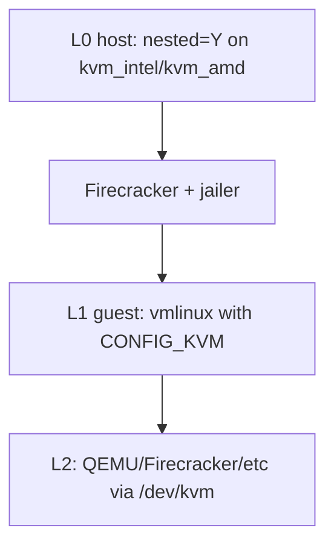

# Building a guest kernel with KVM

This guide explains how to compile a custom Linux guest kernel with KVM support so you can use nested virtualization inside a Firecracker microVM managed by fcvm.

The default output path is `~/.fcvm/images/vmlinux`. Override it with the `kernel` key in your config file ([fcvm.example.yaml](fcvm.example.yaml)), the `FCVM_KERNEL` environment variable, or `--kernel`.

Build fcvm first:

```bash
go build -buildvcs=false -o fcvm .
```

See [README.md](README.md#build) for the full application build and quick-start guide.

## When you need this

| Kernel | Command / path | Use when |
|--------|----------------|----------|
| **Stock CI kernel** | `fcvm download kernel` | Normal guests (no nested VMs) |
| **Custom KVM kernel** | this guide → `~/.fcvm/images/vmlinux` | Nested KVM / `--expose-kvm` |

Firecracker CI guest configs ship with `# CONFIG_VIRTUALIZATION is not set`. That means the downloaded `vmlinux` can *be* a KVM guest (`CONFIG_KVM_GUEST`) but cannot *host* VMs. Nested virt needs a rebuild with hypervisor KVM enabled.



fcvm appends `pci=on fcvm.kvm=1` to the guest kernel cmdline when `--expose-kvm` (or `expose-kvm: true`) is set. That alone is not enough: the host must expose nested virt features, and the guest kernel must include KVM so `/dev/kvm` appears once `vmx`/`svm` is visible.

This guide targets **x86_64**. Nested KVM on aarch64 is limited (newer kernels and platform-specific setup); see [Troubleshooting](#troubleshooting).

## Prerequisites

### Host nested virtualization

1. Confirm `/dev/kvm` exists on the bare-metal (or L0) host.
2. Enable nested mode for the host KVM module (often already `Y` on kernels ≥ 4.19):

Intel:

```bash
# persist across reboots
echo 'options kvm_intel nested=1' | sudo tee /etc/modprobe.d/kvm-intel.conf

# apply now (destroys running VMs that use KVM)
sudo modprobe -r kvm_intel
sudo modprobe kvm_intel
cat /sys/module/kvm_intel/parameters/nested   # expect Y or 1
```

AMD:

```bash
echo 'options kvm_amd nested=1' | sudo tee /etc/modprobe.d/kvm-amd.conf
sudo modprobe -r kvm_amd
sudo modprobe kvm_amd
cat /sys/module/kvm_amd/parameters/nested   # expect Y or 1
```

### Build tools

| Tool | Package (Debian/Ubuntu) |
|------|-------------------------|
| `git`, `make`, `gcc`, `bc` | `git` `make` `gcc` `bc` |
| `flex`, `bison` | `flex` `bison` |
| ELF / OpenSSL headers | `libelf-dev` `libssl-dev` |

```bash
sudo apt-get update
sudo apt-get install -y git make gcc bc flex bison libelf-dev libssl-dev
```

## Build the guest kernel

### 1. Fetch Linux sources

Use a Firecracker-supported version. This guide uses **6.18** to match Firecracker's CI config naming (and to build cleanly on newer host GCC). Firecracker also publishes configs for 5.10 and 6.1 under [`resources/guest_configs/`](https://github.com/firecracker-microvm/firecracker/tree/main/resources/guest_configs).

```bash
git clone --depth 1 --branch v6.18 https://github.com/torvalds/linux.git linux-6.18
cd linux-6.18
```

### 2. Start from Firecracker's recommended config

```bash
curl -fsSL \
  'https://raw.githubusercontent.com/firecracker-microvm/firecracker/main/resources/guest_configs/microvm-kernel-ci-x86_64-6.18.config' \
  -o .config
make olddefconfig
```

Do not replace this with a generic distro `.config`. Firecracker expects an uncompressed ELF `vmlinux` with virtio, ext4, and serial console built in.

### 3. Enable hypervisor KVM and TUN

Stock Firecracker configs leave virtualization and TUN off. Turn them on as **built-in** (`=y`), not modules: Firecracker guests typically have no initramfs to load `.ko` files at boot.

```bash
scripts/config --enable CONFIG_VIRTUALIZATION
scripts/config --enable CONFIG_KVM
scripts/config --enable CONFIG_KVM_INTEL
scripts/config --enable CONFIG_KVM_AMD
scripts/config --enable CONFIG_TUN
make olddefconfig
```

| Option | Role |
|--------|------|
| `CONFIG_VIRTUALIZATION` | Parent menu for KVM hypervisor |
| `CONFIG_KVM` | Core KVM (creates `/dev/kvm` when CPU features allow) |
| `CONFIG_KVM_INTEL` / `CONFIG_KVM_AMD` | Vendor backends; enable both for a generic image, or only the one matching your host CPU |
| `CONFIG_KVM_GUEST` | Already `y` in Firecracker configs — paravirt *as* a guest, not hosting |
| `CONFIG_TUN` | Universal TUN/TAP driver; creates `/dev/net/tun` so L2 hypervisors can create TAP devices for guest networking |

Keep existing Firecracker essentials (`CONFIG_VIRTIO_BLK`, `CONFIG_VIRTIO_NET`, `CONFIG_EXT4_FS`, serial console). If you use `make menuconfig`, do not disable them.

### 4. Compile

```bash
make -j"$(nproc)" vmlinux
```

On success the image is `./vmlinux` (x86_64). For aarch64 builds (limited nested support), use `make Image` and take `arch/arm64/boot/Image`.

### 5. Install for fcvm

```bash
mkdir -p ~/.fcvm/images
cp -f vmlinux ~/.fcvm/images/vmlinux
```

Or point config at another path:

```yaml
kernel: /path/to/vmlinux
```

## Boot with nested KVM

Ensure firecracker, jailer, and a rootfs are in place (see [README.md](README.md#quick-start) and [BUILD.md](BUILD.md)), then start with `--expose-kvm`:

```bash
sudo ./fcvm start myvm --expose-kvm
```

Or in `~/.fcvm.yaml`:

```yaml
expose-kvm: true
kernel: ~/.fcvm/images/vmlinux
```

## Verify

Inside the guest:

```bash
sudo ./fcvm exec myvm -- sh -c 'ls -l /dev/kvm /dev/net/tun; grep -E "vmx|svm" /proc/cpuinfo | head'
```

Checklist:

| Check | Expect |
|-------|--------|
| `/proc/cpuinfo` | `vmx` (Intel) or `svm` (AMD) |
| `/dev/kvm` | character device present |
| `/dev/net/tun` | character device present (TUN/TAP for L2 networking) |
| L2 hypervisor | optional: install qemu/firecracker in the rootfs and run with KVM accel |

The custom kernel exposes `/dev/kvm` and `/dev/net/tun`. Running L2 VMs still needs userspace tools (QEMU, Firecracker, etc.) in the guest rootfs.

## Troubleshooting

| Symptom | Likely cause | Fix |
|---------|--------------|-----|
| No `vmx`/`svm` in guest `/proc/cpuinfo` | Host nested disabled or not applied | Enable `nested=1`, reload `kvm_intel`/`kvm_amd`, confirm sysfs shows `Y`/`1` |
| No `/dev/kvm` but CPU flags present | Guest kernel missing `CONFIG_VIRTUALIZATION`/`CONFIG_KVM`, or KVM built as module without modules in rootfs | Rebuild with options `=y`; confirm with `grep CONFIG_KVM .config` |
| L2 boots but no network / `tuntap` fails | Guest kernel missing `CONFIG_TUN` | Rebuild with `CONFIG_TUN=y`; confirm with `grep CONFIG_TUN .config` |
| VM boots but no network / rootfs | Virtio or ext4 disabled while editing config | Re-copy Firecracker base config and re-enable only KVM and TUN options |
| Boot hang / no serial | Serial console options dropped | Keep Firecracker serial/`ttyS0` settings from the base config |
| Stock `download kernel` still used | Custom `vmlinux` not at config path | Copy to `~/.fcvm/images/vmlinux` or set `kernel:` / `--kernel` |
| Build fails with `'bool'/'false' is a keyword with '-std=c23'` | Older kernels (e.g. 6.1) vs GCC 15+ | Prefer 6.18 as in this guide, or build with `KCFLAGS='-std=gnu11'` / an older GCC |
| aarch64 nested KVM fails | Limited platform/kernel support | Prefer x86_64 for nested virt with fcvm today; aarch64 needs newer kernels and host support beyond this guide |

## See also

- [README.md](README.md) — fcvm build, quick start, Nested KVM feature
- [BUILD.md](BUILD.md) — custom rootfs for workloads that need QEMU/Firecracker inside the guest
- [fcvm.example.yaml](fcvm.example.yaml) — `kernel` and `expose-kvm` defaults
- [Firecracker rootfs and kernel setup](https://github.com/firecracker-microvm/firecracker/blob/main/docs/rootfs-and-kernel-setup.md)
- [Running nested guests with KVM](https://www.kernel.org/doc/html/latest/virt/kvm/running-nested-guests.html)
