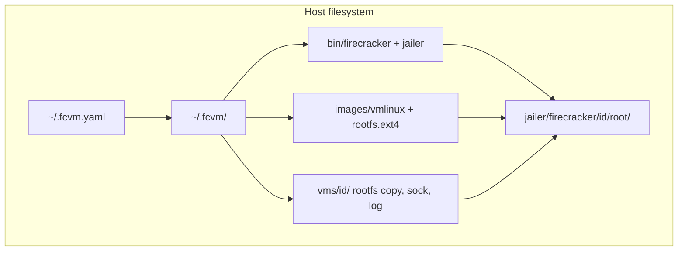

# Elevator pitch

I want to build an application in Golang that can manage the lifecycle of firecracker microvm's.

# Details

This application must be able to:
- Start and stop Firecracker VM's
- Cleanup Firecracker resoures
- Download a Linux kernel from a url
- Download a rootfs from a url
- Build a custom rootfs from scratch using Docker, it should take a custom Dockerfile as parameter for different workloads
- Download the latest release of Firecracker
- Build or download the latest version of Jailer
- Take environment variables and inject them into the firecracker microvm
- Take a folder path as parameter and make it availabe inside the firecracker microvm with nfs
- Run multiple firecracker microvm's side-by-side
- Expose KVM inside the firecracker microvm with a flag
- Access any network or internet resource

After the firecracker microvm has started, i must be able to go inside the microvm and execute commands and/or applications

## Parameters

The application should be configurable with CLI flags using Cobra and Viper. The application should also be to take configuration from a config file which contains default parameters.

# Resources

Firecracker Git repository: https://github.com/firecracker-microvm/firecracker
Firecracker Getting Started: https://raw.githubusercontent.com/firecracker-microvm/firecracker/refs/heads/main/docs/getting-started.md
Firecracker Profuction Host Setup: https://raw.githubusercontent.com/firecracker-microvm/firecracker/refs/heads/main/docs/prod-host-setup.md
Firecracker Go SDK: https://github.com/firecracker-microvm/firecracker-go-sdk
Firecracker GO SDK Docs: https://pkg.go.dev/github.com/firecracker-microvm/firecracker-go-sdk

# Instructions

The LLM should follow all best practices to build this application. Refer to the skills for instructions on building the best Go applications with Viper and Cobra.
The latest Firecracker Go SDK release (1.0.0) is from 2022. Verify if you can build the SDK locally and implement it.
Do not make any assumptions, if you have any questions about a choice to be made, ask the question!
Commit after every major change.

# fcvm — Firecracker microVM manager

Built with Go, Cobra/Viper, and `firecracker-go-sdk` (latest main pseudo-version).

## Prerequisites

- Linux x86_64/aarch64 with `/dev/kvm`
- **Run as root** (jailer, tap/NAT networking, NFS exports)
- Tools: `docker`, `unsquashfs`, `mkfs.ext4`, `ssh`, `ip`, `iptables`

## Build

Build with GoReleaser (injects git tag or short commit into `fcvm version`). See [BUILD.md](BUILD.md#building-fcvm).

## Quick start

```bash
# Download firecracker + jailer
sudo ./fcvm download firecracker

# Download kernel (latest Firecracker CI build) and rootfs
sudo ./fcvm download kernel
sudo ./fcvm download kernel --url 'https://.../vmlinux-...'  # override
sudo ./fcvm download rootfs --url 'https://.../ubuntu-....squashfs'

# Start a VM (always jailed)
sudo ./fcvm start myvm --env FOO=bar --mount /data:/mnt/data

# Run commands inside the guest
sudo ./fcvm exec myvm -- uname -a
sudo ./fcvm shell myvm
sudo ./fcvm attach myvm   # serial log

# Stop and cleanup
sudo ./fcvm stop myvm
sudo ./fcvm cleanup --all
```

## Config file

Copy [fcvm.example.yaml](fcvm.example.yaml) to `~/.fcvm.yaml` as a starting point. fcvm loads config in this order:

1. Built-in defaults (see [config/config.go](config/config.go))
2. Config file: `$HOME/.fcvm.yaml`, or `./.fcvm.yaml` in the current directory
3. Environment variables (`FCVM_*`)
4. CLI flags (highest priority)

Override the config file path with `--config /path/to/fcvm.yaml`. Environment keys mirror config keys with the `FCVM_` prefix and hyphens/dots replaced by underscores — for example `kernel` → `FCVM_KERNEL`, `jailer.chroot-base-dir` → `FCVM_JAILER_CHROOT_BASE_DIR`.

Set `kernel-url` (or `FCVM_KERNEL_URL`) to pin a kernel download source; otherwise `download kernel` resolves the latest vmlinux from Firecracker CI for your architecture.

## Filesystem layout

All paths below use the default state directory `~/.fcvm`. Override the root with `--state-dir` or `FCVM_STATE_DIR`; other paths follow unless set explicitly in config.

### Configuration

| Setting | Default path |
|---------|--------------|
| Config file | `~/.fcvm.yaml` (also `./.fcvm.yaml`; override with `--config`) |
| State dir | `~/.fcvm` |
| Firecracker + jailer | `~/.fcvm/bin/{firecracker,jailer}` |
| Kernel | `~/.fcvm/images/vmlinux` |
| Rootfs | `~/.fcvm/images/rootfs.ext4` |
| SSH key | `~/.fcvm/id_ed25519` |
| Jailer chroot base | `~/.fcvm/jailer` |

### Downloaded and built assets

```
~/.fcvm/
├── bin/
│   ├── firecracker          # fcvm download firecracker
│   ├── jailer               # same tarball as firecracker download
│   ├── firecracker.tgz      # transient during download
│   └── firecracker-src/     # only with: fcvm download jailer --build
├── images/
│   ├── vmlinux              # fcvm download kernel
│   ├── rootfs.ext4          # fcvm download rootfs / build-rootfs
│   └── rootfs.ext4.squashfs # transient if URL is squashfs
└── id_ed25519               # host SSH key for guest access
```

- **Kernel source**: `fcvm download kernel` resolves the latest vmlinux from Firecracker CI S3 for your architecture; pin with `kernel-url` in config or `--url`. For nested KVM, build a custom kernel instead — see [KERNEL.md](KERNEL.md).
- **Rootfs build**: `fcvm build-rootfs` writes to `--output` or the `rootfs` config path. See [BUILD.md](BUILD.md) for detailed rootfs build instructions, Dockerfile requirements, and examples.

### Per-VM runtime

Each VM gets an isolated directory at `~/.fcvm/vms/<id>/` (example: `myvm` from the quick start):

```
~/.fcvm/vms/myvm/
├── state.json           # PID, guest IP, socket paths, mounts
├── rootfs.ext4          # per-VM copy of template rootfs (SSH key patched in)
├── firecracker.sock     # Firecracker API socket
├── firecracker.log      # Firecracker log
└── mount-N.ext4         # block-device fallback for --mount (if NFS unavailable)
```

### Jailer chroot (where Firecracker runs)

Firecracker always runs via jailer. The jailed process chroot is:

```
~/.fcvm/jailer/firecracker/myvm/root/
```

The kernel is bind-mounted into the chroot; rootfs and block images are referenced from host paths outside it. On stop or cleanup, the jailer tree under `~/.fcvm/jailer/firecracker/<id>/` is removed.



### Host networking and NFS

Paths outside `~/.fcvm` that `fcvm start` touches:

| Path | Purpose |
|------|---------|
| `fcvm-tap-<id>` | TAP device per VM |
| `/tmp/fcvm-exports/<id>/share` | bind-mount staging for NFS `--mount` |
| `/etc/exports.d/fcvm-<id>.exports` | NFS export snippet (requires root) |

### Temporary directories

During rootfs conversion or block mounts, fcvm uses short-lived dirs under the system temp directory: `fcvm-unsquash-*`, `fcvm-sync-*`. No manual cleanup needed.

## Features

| Feature | Command / flag |
|---------|----------------|
| Start/stop VMs | `fcvm start`, `fcvm stop` |
| Always via jailer | default, no opt-out |
| Download assets | `fcvm download firecracker\|jailer\|kernel\|rootfs` |
| Docker rootfs | `fcvm build-rootfs --dockerfile path/Dockerfile` |
| Env injection | `--env KEY=VAL` or config `env:` (MMDS → guest) |
| Host folder | `--mount host:guest[:ro]` (NFS, block fallback) |
| Nested KVM | `--expose-kvm` (experimental); needs a custom guest kernel — [KERNEL.md](KERNEL.md) |
| Multi-VM | unique `--id` per VM |
| Self-check | `fcvm self-check` (skips if no KVM) |