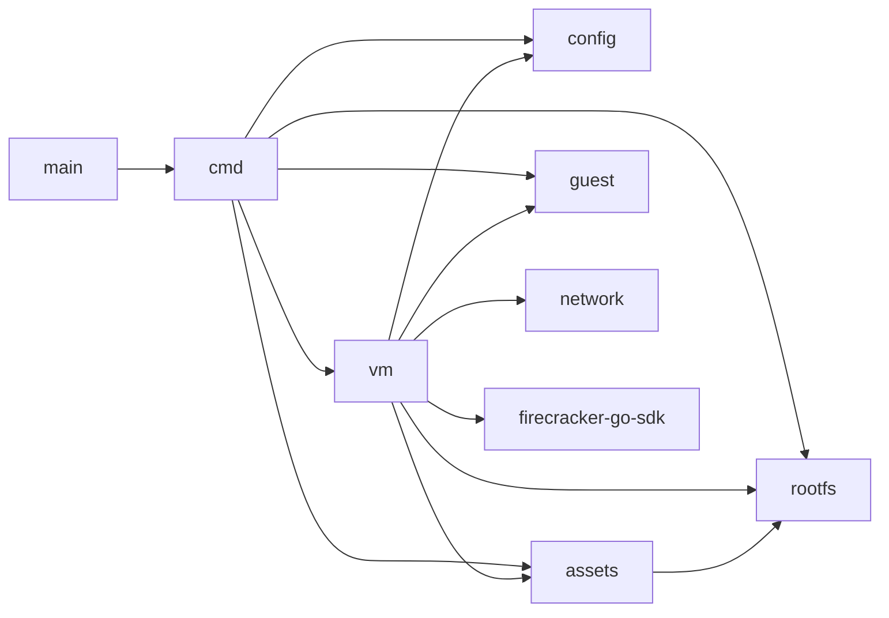

# Architecture

fcvm is a root-required Linux CLI that manages Firecracker microVM lifecycle: download assets, build rootfs images, start/stop jailed VMs, inject env and mounts, and run commands in guests over SSH.

## Packages



| Package | Role |
|---------|------|
| `cmd/` | Cobra commands and Viper config loading |
| `config/` | Config types, defaults, path expansion, validation |
| `vm/` | Lifecycle manager, Firecracker SDK wiring, persisted state |
| `network/` | TAP setup/teardown, CNI teardown, NFS exports |
| `guest/` | SSH key management, exec/shell, serial log tail |
| `assets/` | Download Firecracker/jailer/kernel/rootfs; patch ext4 |
| `rootfs/` | Docker → ext4 build; guest bootstrap hooks |

There is no `internal/` package; packages live at the module root.

## Constraints

- Always runs Firecracker through the **jailer** (no opt-out).
- Requires **root** (jailer, TAP/NAT, NFS) and **`/dev/kvm`**.
- Multiple VMs run side-by-side via unique IDs and index-based TAP/UID allocation.

## On-disk layout

Default state directory: `~/.fcvm` (respects `SUDO_USER` home when run under sudo).

```
~/.fcvm/
  bin/firecracker
  bin/jailer
  images/vmlinux
  images/rootfs.ext4
  id_ed25519          # host SSH private key for guests
  jailer/firecracker/<id>/root/...   # jailer chroot tree per VM
  exports/<id>-<n>/share             # bind-mount staging for NFS mounts
  .lock               # guards VM index allocation
  .ip_forward.orig    # host ip_forward value, restored when the last VM stops
  vms/<id>/
    rootfs.ext4       # per-VM copy of the template rootfs
    mount-<n>.ext4    # block-method mount images
    state.json        # runtime metadata
```

`state.json` records id, network index, pid and its `/proc` start time, socket, network mode (tap/cni), tap device, host egress interface, guest subnet, guest IP/MAC, SSH key path, chroot/log paths, jailer uid/gid, mounts, and env.

VM ids are validated before they are used as path components: letters, digits, `-`, `_` and `.`, up to 64 characters. Everything under this tree is created and removed as root, so an id like `../../etc` is rejected rather than joined into a path.

## Start lifecycle

`vm.Manager.Start` (must be root):

1. Validate the id and config; take the state lock.
2. Reject if `state.json` already exists; wipe leftover jailer tree for the ID.
3. Require firecracker, jailer, kernel, and rootfs on disk.
4. Allocate the lowest free VM index → TAP subnet (or CNI) and jailer uid/gid.
5. Copy template rootfs → `vms/<id>/rootfs.ext4`; in one loop mount, inject hooks, SSH authorized keys, env, and (TAP mode) `/etc/fcvm/network`; `chown` for the jailer.
6. Set up TAP and this VM's firewall rules (or defer networking to the SDK CNI path); build any `method=block` mount images.
7. Build Firecracker config (drives, machine knobs, MMDS v2, NIC, full `JailerCfg`) → `NewMachine` → `Start`.
8. In CNI mode, resolve guest IP/gateway/MAC from the SDK result.
9. Create NFS exports scoped to the resolved guest IP; save `state.json`; wait for SSH; push `/etc/fcvm/mounts` and apply it in the guest.
10. Background `machine.Wait`.

Env is baked into the rootfs at step 5, so it survives reboots and does not depend on SSH. The mount table is pushed at step 9 because NFS exports cannot be scoped until the guest address is known.

If no VM id is given, fcvm generates `vm-<unix-timestamp>`.

## Stop and cleanup

- **Stop:** confirm the PID is still this VM (PID plus `/proc` start time), SIGTERM, poll until `stop-timeout`, SIGKILL only if still alive; mirror writable block mounts back to their host directories; tear down TAP rules or CNI+netns; unexport NFS; remove jailer tree and VM state dir. When the last VM goes, remove the `FCVM` chain and restore `ip_forward`.
- **Cleanup:** same teardown; works with or without `state.json` (best-effort orphans). `cleanup --all` walks all VMs under the state dir.

## Guest bootstrap

Hooks injected into the rootfs (`rootfs.InjectHooks`) provide:

| Path | Role |
|------|------|
| `/usr/local/bin/fcvm-mmds.sh` | MMDS v2 token + GET helpers (`169.254.169.254`) |
| `/usr/local/bin/fcvm-apply-mounts.sh` | Mount everything listed in `/etc/fcvm/mounts` |
| `/usr/local/bin/fcvm-start.sh` | Bring up net, DNS, mounts |
| `/etc/fcvm/env` | Env, written by the host with shell quoting; sourced by `/etc/profile.d/fcvm.sh` |
| `/etc/fcvm/mounts` | Mount table, tab-separated `method`, `source`, `guest` |
| `/etc/systemd/system/fcvm-start.service` | systemd oneshot |
| `/etc/rc.local` | non-systemd fallback |

The guest does not parse JSON. The host already knows the env and mount tables, so it writes them as plain files and the guest scripts just read fields. MMDS stays enabled and reachable for your own use.

Host control plane after boot is **SSH** over the guest IP (`fcvm exec` / `fcvm shell`), not vsock.

## Jailer

Every VM uses Firecracker’s jailer with a chroot under `jailer.chroot-base-dir` (default `~/.fcvm/jailer`). Credentials default to uid/gid `1000`. With `jailer.per-vm-uids: true`, uid/gid become `base + index` (ensure those accounts exist on the host).

Optional jailer knobs: NUMA node, daemonize, parent cgroup, and cgroup resource strings (see [configuration.md](configuration.md)).

## Related docs

- [network.md](network.md) — TAP vs CNI, NFS
- [rootfs.md](rootfs.md) — image build and hooks
- [kernel.md](kernel.md) — stock and custom kernels
- [cli.md](cli.md) — command reference
