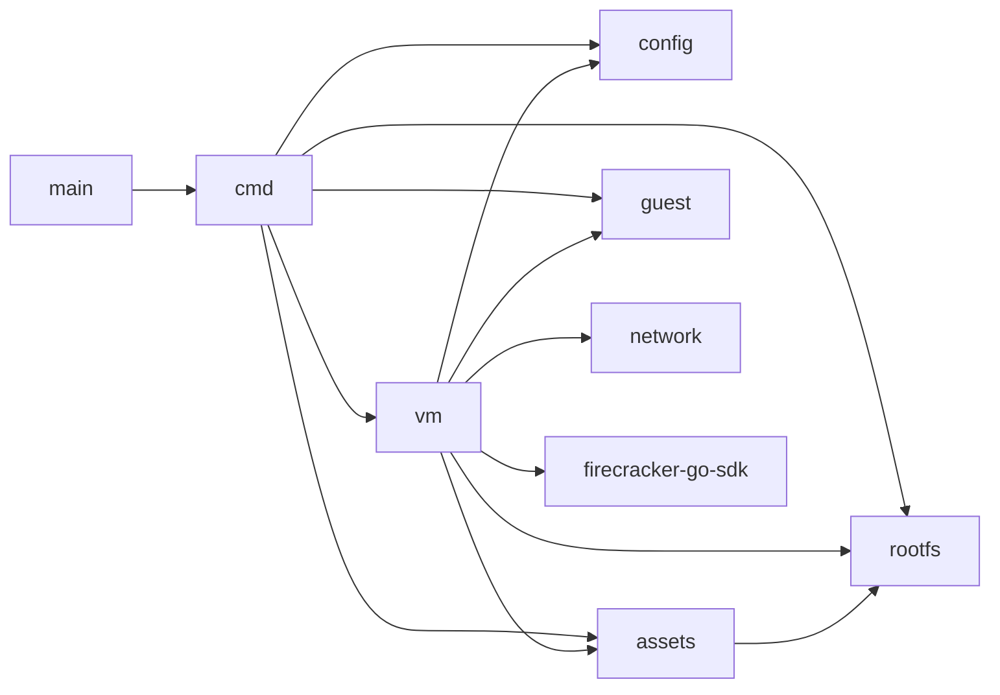

# Architecture

fcvm is a root-required Linux CLI that manages Firecracker microVM lifecycle: download assets, build rootfs images, start/stop jailed VMs, inject env and mounts, and run commands in guests over SSH.

## Packages



| Package | Role |
|---------|------|
| `cmd/` | Cobra commands and Viper config loading |
| `config/` | Config types, defaults, path expansion, validation |
| `vm/` | Lifecycle manager, Firecracker SDK wiring, persisted state |
| `network/` | TAP setup/teardown, CNI teardown, NFS exports |
| `guest/` | SSH key management, exec/shell, serial log tail |
| `assets/` | Download Firecracker/jailer/kernel/rootfs; patch ext4 |
| `rootfs/` | Docker → ext4 build; guest bootstrap hooks |

There is no `internal/` package; packages live at the module root.

## Constraints

- Always runs Firecracker through the **jailer** (no opt-out).
- Requires **root** (jailer, TAP/NAT, NFS) and **`/dev/kvm`**.
- Multiple VMs run side-by-side via unique IDs and index-based TAP/UID allocation.

## On-disk layout

Default state directory: `~/.fcvm` (respects `SUDO_USER` home when run under sudo).

```
~/.fcvm/
  bin/firecracker
  bin/jailer
  images/vmlinux
  images/rootfs.ext4
  id_ed25519          # host SSH private key for guests
  jailer/<id>/...     # jailer chroot tree per VM
  vms/<id>/
    rootfs.ext4       # per-VM copy of the template rootfs
    state.json        # runtime metadata
```

`state.json` records id, pid, socket, network mode (tap/cni), guest IP/MAC, SSH key path, chroot/log paths, mounts, and env.

## Start lifecycle

`vm.Manager.Start` (must be root):

1. Reject if `state.json` already exists; wipe leftover jailer tree for the ID.
2. Validate config; require firecracker, jailer, kernel, and rootfs on disk.
3. Allocate a VM index → TAP subnet (or CNI) and jailer uid/gid.
4. Copy template rootfs → `vms/<id>/rootfs.ext4`; patch SSH authorized keys; in TAP mode, inject static network into `/etc/fcvm/network`; `chown` for the jailer.
5. Set up TAP (or defer networking to the SDK CNI path); set up NFS exports for mounts (fallback: sync host dir into a block ext4).
6. Build Firecracker config (drives, machine knobs, MMDS v2, NIC, full `JailerCfg`) → `NewMachine` → `Start`.
7. In CNI mode, resolve guest IP/gateway/MAC from the SDK result and fill NFS mount metadata.
8. Push env/mounts via MMDS v2; save `state.json`; wait for SSH; run guest mount/env scripts.
9. Background `machine.Wait`.

If no VM id is given, fcvm generates `vm-<unix-timestamp>`.

## Stop and cleanup

- **Stop:** signal the jailer/Firecracker PID, tear down TAP or CNI+netns, unexport NFS, remove jailer tree and VM state dir.
- **Cleanup:** same teardown; works with or without `state.json` (best-effort orphans). `cleanup --all` walks all VMs under the state dir.

## Guest bootstrap

Hooks injected into the rootfs (`rootfs.InjectHooks`) provide:

| Path | Role |
|------|------|
| `/usr/local/bin/fcvm-mmds.sh` | MMDS v2 token + GET helpers (`169.254.169.254`) |
| `/usr/local/bin/fcvm-init-env` | Read env from MMDS → `/etc/fcvm/env` |
| `/usr/local/bin/fcvm-apply-mounts.sh` | NFS and virtio-block mounts from MMDS |
| `/usr/local/bin/fcvm-start.sh` | Bring up net, DNS, mounts, env |
| `/etc/systemd/system/fcvm-start.service` | systemd oneshot |
| `/etc/rc.local` | non-systemd fallback |

Host control plane after boot is **SSH** over the guest IP (`fcvm exec` / `fcvm shell`), not vsock.

## Jailer

Every VM uses Firecracker’s jailer with a chroot under `jailer.chroot-base-dir` (default `~/.fcvm/jailer`). Credentials default to uid/gid `1000`. With `jailer.per-vm-uids: true`, uid/gid become `base + index` (ensure those accounts exist on the host).

Optional jailer knobs: NUMA node, daemonize, parent cgroup, and cgroup resource strings (see [configuration.md](configuration.md)).

## Related docs

- [network.md](network.md) — TAP vs CNI, NFS
- [rootfs.md](rootfs.md) — image build and hooks
- [kernel.md](kernel.md) — stock and custom kernels
- [cli.md](cli.md) — command reference
