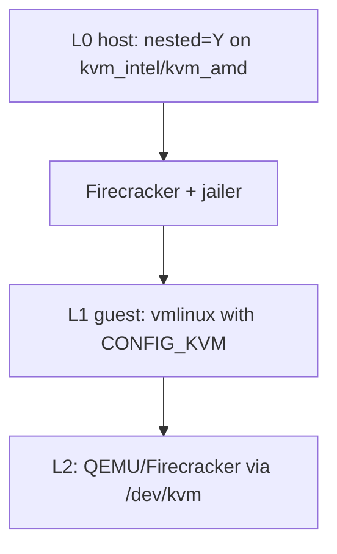

# Kernel

fcvm needs an uncompressed ELF `vmlinux` (x86_64) or equivalent Image (aarch64) at the configured `kernel` path (default `~/.fcvm/images/vmlinux`).

There is no `fcvm` subcommand that compiles a kernel. Use download for stock images, or build manually for nested KVM.

## Download (stock CI kernel)

```bash
sudo ./fcvm download kernel
```

Resolves the latest Firecracker CI `vmlinux` from S3 for the host architecture (`assets.LatestFirecrackerKernelURL`), unless you pin a URL:

```bash
sudo ./fcvm download kernel --url 'https://…/vmlinux-6.1.x'
```

Or set `kernel-url` / `FCVM_KERNEL_URL` in config/env. Output path follows `kernel` / `--kernel`.

Stock Firecracker CI guest configs ship with `# CONFIG_VIRTUALIZATION is not set`. The guest can *be* a KVM guest (`CONFIG_KVM_GUEST`) but cannot *host* VMs. Nested virt needs a custom rebuild.

| Kernel | How | Use when |
|--------|-----|----------|
| Stock CI | `fcvm download kernel` | Normal guests |
| Custom KVM | this guide → `kernel` path | Nested KVM |

## Runtime kernel args

Default (`kernel-args`):

```
console=ttyS0 reboot=k panic=1 net.ifnames=0 biosdevname=0
```

Nested virt needs host nested mode and a guest kernel with KVM built in — no extra fcvm flag.

## Custom kernel with KVM (nested virt)



This section targets **x86_64**. Nested KVM on aarch64 is limited.

### Host nested virtualization

1. Confirm `/dev/kvm` exists on the L0 host.
2. Enable nested mode:

Intel:

```bash
echo 'options kvm_intel nested=1' | sudo tee /etc/modprobe.d/kvm-intel.conf
sudo modprobe -r kvm_intel && sudo modprobe kvm_intel
cat /sys/module/kvm_intel/parameters/nested   # expect Y or 1
```

AMD:

```bash
echo 'options kvm_amd nested=1' | sudo tee /etc/modprobe.d/kvm-amd.conf
sudo modprobe -r kvm_amd && sudo modprobe kvm_amd
cat /sys/module/kvm_amd/parameters/nested   # expect Y or 1
```

### Build tools (Debian/Ubuntu)

```bash
sudo apt-get update
sudo apt-get install -y git make gcc bc flex bison libelf-dev libssl-dev
```

### Build steps

1. Fetch a Firecracker-supported Linux version (example: **v6.18**):

```bash
git clone --depth 1 --branch v6.18 https://github.com/torvalds/linux.git linux-6.18
cd linux-6.18
```

2. Start from Firecracker’s guest config (do not use a generic distro config):

```bash
curl -fsSL \
  'https://raw.githubusercontent.com/firecracker-microvm/firecracker/main/resources/guest_configs/microvm-kernel-ci-x86_64-6.18.config' \
  -o .config
make olddefconfig
```

Other published configs live under [resources/guest_configs](https://github.com/firecracker-microvm/firecracker/tree/main/resources/guest_configs).

3. Enable hypervisor KVM and TUN as **built-in** (`=y`), not modules (no initramfs):

```bash
scripts/config --enable CONFIG_VIRTUALIZATION
scripts/config --enable CONFIG_KVM
scripts/config --enable CONFIG_KVM_INTEL
scripts/config --enable CONFIG_KVM_AMD
scripts/config --enable CONFIG_TUN
make olddefconfig
```

| Option | Role |
|--------|------|
| `CONFIG_VIRTUALIZATION` | Parent menu for KVM hypervisor |
| `CONFIG_KVM` | Core KVM (`/dev/kvm`) |
| `CONFIG_KVM_INTEL` / `CONFIG_KVM_AMD` | Vendor backends |
| `CONFIG_KVM_GUEST` | Already `y` in Firecracker configs — paravirt *as* a guest |
| `CONFIG_TUN` | `/dev/net/tun` for L2 TAP networking |

Keep Firecracker essentials: `CONFIG_VIRTIO_BLK`, `CONFIG_VIRTIO_NET`, `CONFIG_EXT4_FS`, serial/`ttyS0`.

4. Compile and install:

```bash
make -j"$(nproc)" vmlinux
mkdir -p ~/.fcvm/images
cp -f vmlinux ~/.fcvm/images/vmlinux
```

On aarch64 (limited nested support): `make Image` and use `arch/arm64/boot/Image`.

Or point config at another path:

```yaml
kernel: /path/to/vmlinux
```

### Boot and verify

```bash
sudo ./fcvm start myvm
sudo ./fcvm exec myvm -- sh -c 'ls -l /dev/kvm /dev/net/tun; grep -E "vmx|svm" /proc/cpuinfo | head'
```

| Check | Expect |
|-------|--------|
| `/proc/cpuinfo` | `vmx` (Intel) or `svm` (AMD) |
| `/dev/kvm` | character device present |
| `/dev/net/tun` | character device present |

Running L2 VMs still needs userspace tools (QEMU, Firecracker, etc.) in the guest rootfs — see [rootfs.md](rootfs.md).

### Troubleshooting

| Symptom | Likely cause | Fix |
|---------|--------------|-----|
| No `vmx`/`svm` in guest | Host nested disabled | Enable `nested=1`, reload module, confirm sysfs |
| No `/dev/kvm` but CPU flags present | KVM missing or built as module | Rebuild with options `=y` |
| L2 `tuntap` fails | Missing `CONFIG_TUN` | Rebuild with `CONFIG_TUN=y` |
| No network / rootfs | Virtio or ext4 disabled | Re-copy Firecracker base config |
| Boot hang / no serial | Serial options dropped | Keep `ttyS0` from base config |
| Stock kernel still used | Wrong path | Copy to `~/.fcvm/images/vmlinux` or set `kernel:` |
| Build fails on GCC 15+ / older kernels | C23 keyword clash | Prefer 6.18, or `KCFLAGS='-std=gnu11'` |

## Related docs

- [install.md](install.md) — asset download and host setup
- [rootfs.md](rootfs.md) — guest images for nested workloads
- [configuration.md](configuration.md) — `kernel`, `kernel-args`
