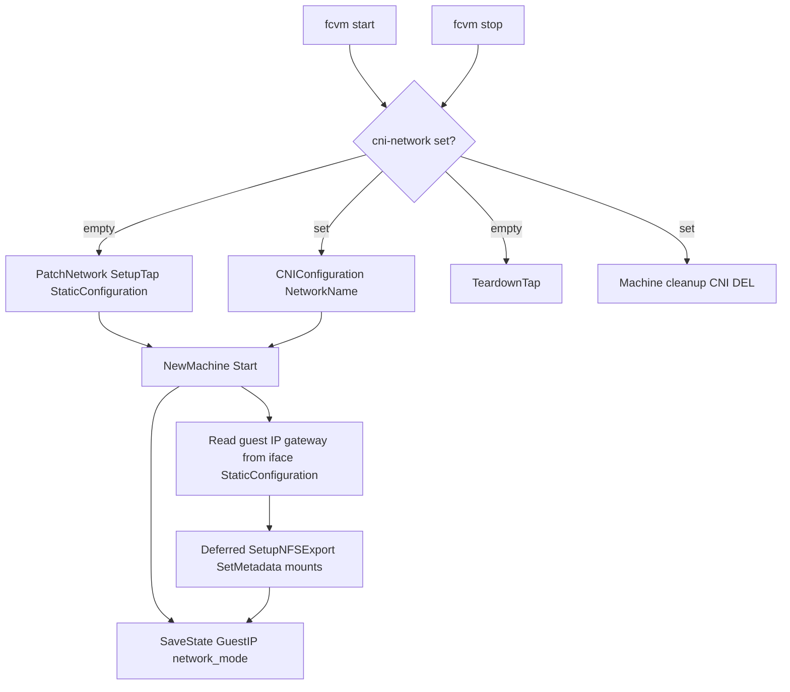

# Optional CNI networking

Wire firecracker-go-sdk CNI so operators can set `network.cni-network` and get netns-isolated guest networking. Keep static TAP + MASQUERADE as the default when the field is empty.

Related: jailer netns is a side effect of CNI in the SDK — see [jailer-isolation.md](jailer-isolation.md) phase 2 (CNI details live here).

## Status

**Implemented.** Everything in this doc's checklist below shipped; the checklist was just never updated to reflect it, and `TODO.md` still listed this as open. `network.cni-network` stays behind `--enable-experimental` (a deliberate choice, not a gap) while it sees real-world use. Follow-up hardening (test coverage parity with TAP, a preflight check for host prerequisites, a fixed NFS-gateway edge case, and a documentation rewrite) is a separate, later change — see `TODO.md` for its status. A further-out plan to formalize the TAP/CNI branch into a `NetworkProvider` interface lives in [network-provider-interface.md](network-provider-interface.md); it is intentionally not part of this doc's scope.

## Goal

- When `network.cni-network` is non-empty, start the VM with `CNIConfiguration` instead of hand-rolled TAP.
- Persist the resolved guest IP for SSH/`exec`/list.
- Defer NFS mount setup until after CNI assigns addresses.
- Leave the empty-`cni-network` path behaviorally identical to today.

## Non-goals

- Do not remove or demote static TAP as default.
- Do not vendor or install CNI plugins inside fcvm; document host requirements only.
- Do not support multiple guest NICs (SDK limitation with IP config).
- Do not implement jailer cgroup/uid knobs here (that is [jailer-isolation.md](jailer-isolation.md)).

## Locked decisions

| Topic | Choice |
|-------|--------|
| Activation | `network.cni-network` non-empty → CNI; empty → today’s TAP |
| Guest IP | SDK fills from CNI result (`tc-redirect-tap`); write into `state.GuestIP` after `Start` |
| Rootfs patch | Skip `PatchNetwork` in CNI mode; rely on SDK `ip=` kernel config (guest hooks no-op if `/etc/fcvm/network` is missing) |
| NFS | Defer `SetupNFSExport` + MMDS mount metadata until after `Start`; use resolved gateway as NFS server address |
| Cleanup | No `TeardownTap` / orphan `fcvm-tap-*` for CNI VMs; fcvm's own `network.TeardownCNI` runs CNI DEL (not the SDK's cleanup-on-exit, which never fires — see "Stop / cleanup" below) |
| State | Record CNI mode (e.g. `network_mode: "cni"` or empty `tap_dev`); skip tap-index / expected-guest-IP validation for those VMs |
| Default path | Static TAP unchanged |

## Current flow

Today ([vm/manager.go](../vm/manager.go)):

1. Allocate VM index → `tapIP`/`guestIP` via `SubnetForIndex`, `tapDev` via `TapDevName`.
2. `assets.PatchNetwork(rootfs, guestIP, tapIP)`.
3. `network.SetupTap` (TAP + ip_forward + shared MASQUERADE).
4. NFS exports using `guestIP` / mount metadata `tapIP:exportPath`.
5. `NetworkInterfaces` with `StaticConfiguration` (MAC, `HostDevName`, IP/gateway/DNS).
6. On stop: `TeardownTap(state.TapDev)`.

`config.NetworkConfig.CNINetwork` already exists and is unused ([config/config.go](../config/config.go), [fcvm.example.yaml](../fcvm.example.yaml)).

## CNI flow



### Start (CNI branch)

1. Skip `PatchNetwork`, `SetupTap`, and static IP/MAC derivation from config tap/guest base.
2. Build:

```go
NetworkInterfaces: []firecracker.NetworkInterface{{
  CNIConfiguration: &firecracker.CNIConfiguration{
    NetworkName: m.cfg.Network.CNINetwork, // e.g. "fcnet"
    IfName:      "veth0",
    VMIfName:    "eth0",
  },
  AllowMMDS: true,
}}
```

3. SDK creates `/var/run/netns/<VMID>`, runs CNI ADD, fills `StaticConfiguration` from `tc-redirect-tap` result, passes `--netns` to jailer.
4. After `machine.Start`: read guest IP and gateway from the resolved interface config.
5. Run deferred NFS setup with that guest IP; MMDS mount `host` = `gateway:exportPath`.
6. `SaveState` with `GuestIP`, `network_mode: "cni"` (or empty `TapDev`), no `fcvm-tap-N` reclaim responsibility.

### Stop / cleanup (CNI branch)

- Do not call `TeardownTap`.
- fcvm's own `network.TeardownCNI` runs CNI DEL and removes the netns mount — **not** the SDK's own cleanup-on-exit path. The SDK's `Machine` registers cleanup funcs that fire when its own `m.cmd.Wait()` goroutine sees the child process exit, but that goroutine lives inside the `fcvm start` process, which returns and exits right after `Start()` succeeds — it's gone long before Firecracker itself ever exits. `network.TeardownCNI` is therefore required, not redundant.
- Neither TAP nor CNI has automatic orphan-state reclaim in `cleanup --all` today (a stopped-mid-flight VM's TAP device, or a CNI netns/cache, both need manual cleanup per docs/debug.md); this is a pre-existing gap in both modes, not something CNI needs to catch up on.

## Host prerequisites

Document in [docs/network.md](../docs/network.md):

- Plugins under `/opt/cni/bin`: `ptp`, `host-local`, `firewall`, `tc-redirect-tap` (and any others the conflist needs).
- Config under `/etc/cni/conf.d`, e.g. `fcnet.conflist`:

```json
{
  "name": "fcnet",
  "cniVersion": "0.3.1",
  "plugins": [
    {
      "type": "ptp",
      "ipMasq": true,
      "ipam": {
        "type": "host-local",
        "subnet": "192.168.127.0/24",
        "resolvConf": "/etc/resolv.conf"
      }
    },
    { "type": "firewall" },
    { "type": "tc-redirect-tap" }
  ]
}
```

- `network.cni-network` must match the conflist `name` field.

## Code touch list

| Area | Change |
|------|--------|
| [vm/manager.go](../vm/manager.go) | Branch on `CNINetwork`; skip TAP/patch; CNI iface; post-Start IP + deferred NFS; stop teardown branch |
| [vm/state.go](../vm/state.go) | `NetworkMode` (or equivalent); skip tap/guest consistency checks for CNI |
| [config/config.go](../config/config.go) / [cmd/root.go](../cmd/root.go) | Field already exists; bind/document if needed |
| [fcvm.example.yaml](../fcvm.example.yaml) | Uncomment/document `cni-network` as optional CNI mode |
| [docs/network.md](../docs/network.md) | CNI mode section, sample conflist, plugin deps |
| Tests | One unit test: building start config with CNI set yields `CNIConfiguration` and does not call `SetupTap` (extract iface-building helper if that keeps the test small) |

## Checklist

- [x] Branch `Start` on non-empty `network.cni-network` (`vm/manager.go`'s `useCNI`).
- [x] Skip `PatchNetwork` + `SetupTap` on CNI path; use `CNIConfiguration` (`vm/fc_config.go`'s `buildNetworkInterfaces`).
- [x] After `Start`, resolve guest IP/gateway into state and deferred NFS/MMDS (`resolveCNIAddrs`, `setupMounts` in `vm/manager.go`).
- [x] Stop/cleanup: no `TeardownTap` for CNI VMs; state validation skips TAP index checks (`vm/manager.go`'s `teardownState`, `vm/state.go`'s `IsCNI`).
- [x] Example yaml + docs/network.md host setup.
- [x] One runnable test that CNI branch selects `CNIConfiguration` and skips TAP setup (`vm/fc_config_test.go`'s `TestBuildFirecrackerConfigCNI`).

All of the above shipped. What came after — closing a real NFS-gateway edge case, a host-prerequisites preflight check, test coverage for `network/cni.go` and `resolveCNIAddrs` on par with TAP's, and the docs rewrite this doc originally scoped as one line — is tracked as its own hardening pass; see `TODO.md`.

## Success criteria

- [x] `fcvm start` with empty `cni-network` unchanged.
- [x] `fcvm start` with `cni-network: fcnet` (and host plugins/conflist) boots, SSH works to CNI-assigned IP, stop cleans via CNI DEL.
- [x] NFS mounts (if configured) work after deferred setup using CNI gateway (now enforced: `setupMounts` errors out instead of silently exporting to the wrong address if the CNI result has no gateway).
