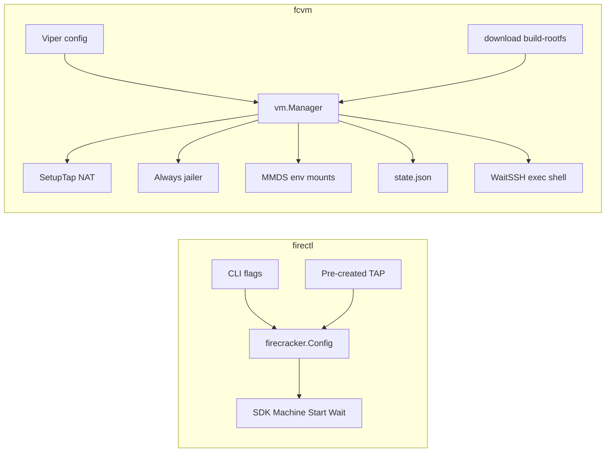

# Improve fcvm from firectl lessons

Status: **deferred — design only, no implementation yet.**  
Source: comparative reading of cloned [firectl/](../firectl/) (`firecracker-microvm/firectl`) vs this repo.  
Related: [jailer-isolation.md](jailer-isolation.md), [cni-network.md](cni-network.md), [TODO.md](../TODO.md).

## Goal

Steal a small set of Firecracker knobs and one testing pattern from firectl. Do **not** reshape fcvm into a single-shot launcher. Keep multi-VM lifecycle, always-on jailer, TAP/NAT, assets, MMDS env/mounts, and SSH.

## Background: how the tools differ



| Dimension | firectl | fcvm today |
|-----------|---------|------------|
| Role | One-shot flag → SDK adapter | Multi-VM host operator |
| Layout | Flat `package main` | `cmd/`, `config/`, `vm/`, `network/`, `assets/`, `rootfs/`, `guest/` |
| CLI | jessevdk/go-flags, no subcommands | Cobra + Viper (`FCVM_*`, yaml) |
| Process | Foreground `Start` → `Wait`; optional jailer `--daemonize` | Start, persist `state.json`, background `waitVM`, stop via host PID |
| Jailer | Optional | Always on |
| Networking | Caller creates TAP; `--tap-device=DEV/MAC` | Creates TAP + shared MASQUERADE |
| Guest access | Serial console | SSH + injected rootfs hooks |
| Assets | None | `download`, `build-rootfs`, ext4 patch |
| SDK | `firecracker-go-sdk v1.0.0` | Newer SDK (`v1.0.1-0.20251224…`) |

### firectl lifecycle (reference)

1. Parse flags into `options` ([firectl/options.go](../firectl/options.go)).
2. `getFirecrackerConfig()` → pure `firecracker.Config` (unit-tested heavily).
3. Stat/validate Firecracker binary (exists, not dir, executable bit).
4. If no jailer: `VMCommandBuilder` + `WithProcessRunner`; if jailer: SDK builds jailer argv in `NewMachine`.
5. `m.Start` → optional `SetMetadata` → signal handlers → `m.Wait`; `defer m.StopVMM`.
6. Signals: INT/TERM → `m.Shutdown`; QUIT → `m.StopVMM` ([firectl/main.go](../firectl/main.go)).

### fcvm start lifecycle (reference)

Today in [vm/manager.go](../vm/manager.go) `Manager.Start`:

1. Root + trusted assets + VMID uniqueness.
2. Allocate index → TAP subnet/MAC; copy/patch rootfs; `SetupTap`.
3. NFS or block-mount drives.
4. Inline build of `firecracker.Config` (hardcoded kernel args, log level, numa=0).
5. `NewMachine` + trust re-checks → `Start` → `SetMetadata` → `SaveState` → `WaitSSH` → apply mounts/env → `go waitVM`.

Stop: load state → SIGTERM then Kill PID → teardown TAP/NFS/jailer tree ([vm/manager.go](../vm/manager.go) `Stop`).

---

## Non-goals (locked)

- Do not make jailer optional.
- Do not replace TAP+MASQUERADE with “bring your own TAP” as the only path.
- Do not switch CLI to go-flags or flatten into `package main`.
- Do not replace structured MMDS (`env` / `mounts`) with raw `--metadata` JSON as the primary UX.
- Do not implement CNI in this plan (see [cni-network.md](cni-network.md)).
- Do not fix mount-empty-on-cleanup / block-sync here (see [TODO.md](../TODO.md); separate higher-priority track).
- Do not add abstractions beyond config → builder → SDK fields.
- No new dependencies.

---

## Gap inventory (firectl has / fcvm hardcodes or omits)

Current hardcoded block in [vm/manager.go](../vm/manager.go) (~L222–290):

| Capability | firectl | fcvm today | Priority |
|------------|---------|------------|----------|
| Kernel cmdline | `--kernel-opts` | Hardcoded `console=ttyS0 reboot=k panic=1 net.ifnames=0 biosdevname=0` (+ `pci=on fcvm.kvm=1` if expose-kvm) | Slice 1 |
| VMM log level | `--log-level` (default Debug) | `LogLevel: "Info"` fixed | Slice 1 |
| CPU template | `--cpu-template` C3/T2 | unset | Slice 1 |
| SMT | `--disable-smt` → `Smt: false` | unset (SDK default) | Slice 1 |
| Jailer NUMA | `--node` | `numa := 0` hardcoded | Slice 2 |
| Jailer daemonize | `--daemonize` | always false / unset | Slice 2 |
| Jailer cgroups | (SDK fields; firectl partial) | not in config | Slice 2 ([jailer-isolation.md](jailer-isolation.md)) |
| Initrd | `--initrd-path` | none | Slice 3 |
| Vsock | `--vsock-device=PATH:CID` | none | Slice 3 |
| Metrics FIFO | `--metrics-fifo` | none (`LogPath` only) | Slice 3 |
| Extra drives + ro/rw | `--add-drive=path:ro\|rw` | block-mount images only, always rw | Slice 3 |
| Root Partuuid | `--root-partition` | none | Slice 3 / skip unless needed |
| Multi-NIC | repeatable `--tap-device` | single NIC | skip (YAGNI) |
| Version + FC floor | prints `SupportedFirecrackerVersion` | prints link-time `version` only | Slice 1 (tiny) |
| Pure config builder tests | `options_test.go` | config built inside `Start` | Slice 0 (prerequisite) |
| Graceful API shutdown | `m.Shutdown` on signal | host SIGTERM/Kill only | Slice 4 (optional) |

---

## Patterns to borrow

### 1. Pure `firecracker.Config` builder (required foundation)

Extract construction out of `Manager.Start` so behavior is unit-testable without KVM/root.

**Proposed API** (name flexible; keep in `vm` package):

```text
type machineBuildInput struct {
  ID          string
  RootfsPath  string
  BlockImages []string          // existing block-mount fallback paths
  TapDev      string
  TapIP       string
  GuestIP     string
  GuestMAC    string
  // later slices may add: Initrd, Vsocks, MetricsFifo, ExtraDrives, …
}

func buildFirecrackerConfig(cfg config.Config, in machineBuildInput) (firecracker.Config, error)
```

**Responsibilities of the builder:**

- Kernel args: base from `cfg.KernelArgs` (or default constant); if `cfg.ExposeKVM`, append ` pci=on fcvm.kvm=1` exactly as today (do not double-append if user already included them — pick one rule and test it; recommended: always append when `ExposeKVM` and not already present).
- `LogPath` / `SocketPath`: keep today’s relative names (`firecracker.log`, `firecracker.sock`) for jailer chroot layout.
- `LogLevel` from config.
- `MachineCfg`: VCPU, mem, optional `CPUTemplate`, `Smt: !DisableSMT` (when disable-smt unset/false → `Smt: true` to match firectl’s default SMT-on behavior, or omit field if SDK zero-value is acceptable — **lock at implement time by checking SDK/Firecracker default and matching today’s observed behavior**).
- Drives: rootfs + `dataN` block images (unchanged IDs).
- NetworkInterfaces: single static NIC + `AllowMMDS: true` + MMDS v2 (unchanged).
- `JailerCfg`: always set; pull uid/gid/numa/daemonize/cgroup fields from `cfg.Jailer`; keep `jailerCgroupVersion()`, `NaiveChrootStrategy(filepath.Base(cfg.Kernel))`.

**`Manager.Start` after extract:** only orchestration (trust, copy, TAP, mounts, `NewMachine`, metadata, state, SSH). No duplicated field literals.

**Test file:** `vm/fc_config_test.go` (or `vm/machine_config_test.go`) — table-driven, no root required.

### 2. Supported Firecracker version on `version`

Mirror firectl’s [firectl/version.go](../firectl/version.go): add a constant (e.g. in `cmd/version.go` or `vm/`) for the Firecracker API/SDK floor this tree targets, print alongside `version`.

Do not invent a hard runtime check against the binary unless you later want it; printing is enough for operators.

### 3. Graceful shutdown (optional later)

firectl uses API `Shutdown` before force-stop. fcvm `Stop` signals the jailer/Firecracker PID. Optional improvement: if jailer API socket path in state is reachable, try SDK/`Shutdown` (or HTTP to sock) then fall back to SIGTERM/Kill. Requires care with jailed socket paths and privileges — design before coding; not part of Slice 1–2.

---

## Slice 0 — Extract builder (do first, behavior-identical)

### Files

- Add: `vm/fc_config.go` (builder + default kernel-args constant).
- Add: `vm/fc_config_test.go`.
- Edit: [vm/manager.go](../vm/manager.go) — replace inline `fcCfg := firecracker.Config{...}` with builder call.
- No config/CLI changes in this slice.

### Verify

- `go test ./vm/ -count=1` — builder tests assert today’s defaults (kernel args string, LogLevel Info, numa 0, drive IDs, AllowMMDS, MmdsVersion).
- Full `go test ./...`.
- Manual smoke (if KVM available): `fcvm start` / `exec` / `stop` unchanged.

---

## Slice 1 — Machine knobs (firectl parity that matters)

### Config surface

Extend [config/config.go](../config/config.go) `Config`:

```yaml
# fcvm.example.yaml additions
kernel-args: "console=ttyS0 reboot=k panic=1 net.ifnames=0 biosdevname=0"
log-level: Info          # Firecracker log level
cpu-template: ""         # empty = unset; else C3 / T2 (or whatever current FC accepts)
disable-smt: false
```

Also:

- `config.Default()` sets the same kernel-args string used today.
- `Validate()`: if `cpu-template` non-empty, optionally allowlist known templates (keep loose if Firecracker adds templates — prefer pass-through with docs).
- [cmd/root.go](../cmd/root.go): `SetDefault` + optional persistent flags + `BindPFlag` for the four keys (match existing style for `vcpu-count` / `mem-size-mib`).
- Env: `FCVM_KERNEL_ARGS`, `FCVM_LOG_LEVEL`, `FCVM_CPU_TEMPLATE`, `FCVM_DISABLE_SMT` via existing AutomaticEnv replacer.

### Builder wiring

- `KernelArgs` / `LogLevel` / `MachineCfg.CPUTemplate` / `MachineCfg.Smt` from config.
- Empty `cpu-template` → leave `CPUTemplate` zero/unset (do not send empty string if API rejects it — match SDK idioms).

### Version command

- [cmd/version.go](../cmd/version.go): print app version and supported Firecracker version constant.

### Docs

- Short note in README or [docs/install.md](../docs/install.md) / [docs/configuration.md](../docs/configuration.md): new keys and defaults.
- Update [fcvm.example.yaml](../fcvm.example.yaml) with commented examples.

### Verify

- Unit: default config → builder output equals pre-Slice-1 baseline.
- Unit: overrides flip LogLevel, KernelArgs, CPUTemplate, Smt.
- Unit: `ExposeKVM` still appends pci/kvm tokens.
- `go test ./...`.
- No change to start/stop without new yaml keys.

---

## Slice 2 — Jailer phase 1

Implement [jailer-isolation.md](jailer-isolation.md) phase 1 **using the same builder**.

### Config

```yaml
jailer:
  chroot-base-dir: ~/.fcvm/jailer
  uid: 1000
  gid: 1000
  numa-node: 0
  daemonize: false
  parent-cgroup: ""
  cgroup: []    # → JailerCfg.CgroupArgs
```

### Wire

- Extend `config.JailerConfig`.
- Defaults: numa 0, daemonize false, empty parent-cgroup/cgroup.
- Builder sets `NumaNode`, `Daemonize`, `ParentCgroup`, `CgroupArgs` on `JailerCfg`.
- **Do not** default `daemonize: true` until PID tracking (`machine.PID()` / `firecracker.pid` under jail root) is confirmed with daemonize on — leave false.

### Docs / tests

- As listed in jailer-isolation.md phase 1 checklist.
- Builder unit test: non-default numa/cgroup args appear on `JailerCfg`.

### Out of scope here

- Phase 2 CNI/netns/per-VM uids → [cni-network.md](cni-network.md) + jailer-isolation phase 2.
- Phase 3 `--new-pid-ns` / `--resource-limit` if SDK lacks fields.

---

## Slice 3 — Optional Firecracker features (implement only with a use case)

Each item is independently optional. Prefer one PR per feature.

### 3a Initrd

- Config: `initrd: ""` / `initrd-path`.
- Builder: `InitrdPath` when non-empty.
- Jailer chroot strategy may need the initrd file linked — confirm `NaiveChrootStrategy` / SDK copies initrd into chroot; add trust check like kernel if required.

### 3b Vsock

- Config: list of `path:cid` (yaml list or repeated flag).
- Parse like firectl `parseVsocks` (sentinel errors for bad CID).
- Builder: `VsockDevices`.
- Document host UDS path location relative to jailer chroot (paths are easy to get wrong when jailed).

### 3c Metrics / richer logs

- Config: `metrics-fifo` and/or keep `LogPath` vs FIFO (firectl’s FIFO vs file conflict rules).
- Under jailer, FIFO paths must live where the jailed process can open them — design carefully; may be lower value than `LogPath` + `attach` today.

### 3d User extra drives (`:ro`/`:rw`)

- Distinct from mount block-fallback: operator-supplied disk images.
- Config/CLI akin to firectl `--add-drive`.
- Honor read-only flag on `models.Drive`.
- Trust/ownership: same jailer chown/`requireTrustedAsset` rules as rootfs copy where applicable.

### 3e Root Partuuid

- Only if someone boots a partitioned root image; otherwise skip.

---

## Slice 4 — Optional stop polish

- Investigate using Firecracker API graceful shutdown when socket is usable from the host after jailer start.
- Fall back to today’s SIGTERM/Kill.
- One self-check or unit test with a fake/mocked machine if practical; otherwise document manual verify.
- Do not regress `cleanup --all` / orphan TAP teardown.

---

## Separate track (not from firectl; higher product pain)

Do these outside this plan when prioritizing user-facing bugs:

1. Mounted folder emptied on microVM crash or `fcvm cleanup` ([TODO.md](../TODO.md)).
2. Sync block-fallback images back to host directory on stop.
3. Optional CNI ([cni-network.md](cni-network.md)).
4. `ARCHITECTURE.md` (docs debt).

---

## Suggested PR sequence (when implementing)

1. **PR0:** Slice 0 only — extract builder + tests, zero behavior change.
2. **PR1:** Slice 1 — machine knobs + version line + example yaml/docs.
3. **PR2:** Slice 2 — jailer phase 1 (or merge with PR1 if tiny).
4. **PR3+:** Slice 3 items only when needed; Slice 4 if stop UX hurts.

---

## Success criteria (overall)

- Default config path: identical guest/network/jailer behavior to pre-change fcvm.
- New knobs: visible in built `firecracker.Config` via unit tests without `/dev/kvm`.
- Jailer remains mandatory.
- No new dependencies; fewest files possible (`fc_config.go` + tests + config/cmd/example/docs touches).
- `go test ./...` green; smoke start/exec/stop when hardware allows.

## Explicitly rejected copies from firectl

- Optional non-jailer `VMCommandBuilder` path.
- Pre-created TAP as default networking.
- Foreground-only VMM supervisor replacing `state.json` + `waitVM`.
- Raw JSON `--metadata` replacing fcvm MMDS schema.
- Multi-NIC TAP list without a concrete multi-homing need.
