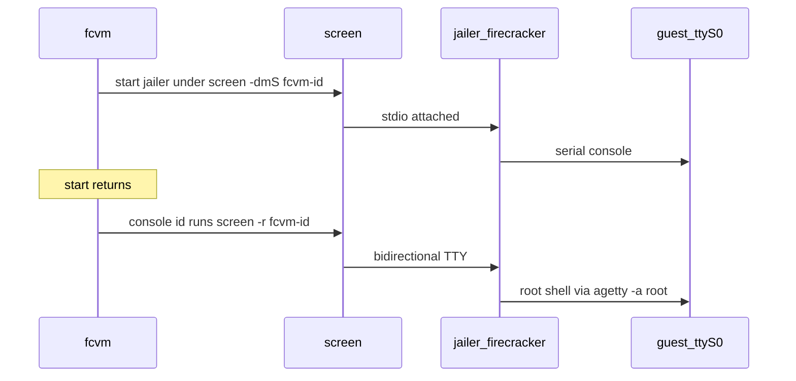

# Interactive serial console via screen

Add `fcvm console <id>` so operators can attach to the guest serial console like a physical server console. Keep SSH (`exec`/`shell`) and read-only `attach` as they are today.

## Goal

- Bidirectional serial console attach/detach after `fcvm start` returns.
- Root shell on `ttyS0` without a password (autologin).
- Host dependency: `screen` (same class as `ssh` / `tail`).

## Non-goals

- No vsock.
- No replacing SSH `exec`/`shell`.
- No programmatic “send command over serial” API (firectl does not have one either).
- No changing default `daemonize` (stays false); `daemonize: true` remains incompatible with console.
- No new Go module dependencies.
- Do not turn `fcvm attach` into an interactive console (it stays log tail).

## Background: how firectl does serial

[firectl-lessons.md](firectl-lessons.md) lists firectl guest access as “serial console.” That means **interactive TTY passthrough**, not a command-injection subsystem.

Three layers:

1. **Guest:** kernel cmdline includes `console=ttyS0`; getty/shell (whatever the rootfs provides) talks on serial.
2. **Firecracker:** emulated UART is bound to the VMM process’s stdin/stdout. Whoever owns that stdio owns the console.
3. **firectl:** stays in the foreground, wires the host terminal to the process, and blocks on `m.Wait`:
   - Non-jailer: `VMCommandBuilder.WithStdin/Stdout/Stderr(os.Std*)` + `WithProcessRunner`
   - Jailer: `JailerConfig{Stdin, Stdout, Stderr: os.Std*}`

There is no firectl code that writes shell strings to serial, no expect-style automation, and no `exec`-like guest RPC over UART. “Commands” are keystrokes the operator types into the attached terminal.

| Interpretation | firectl |
|---|---|
| Operator types in the attached terminal | Yes — stdin → Firecracker → guest ttyS0 |
| Programmatic `exec`-style injection over serial | No |
| Separate serial device / UNIX socket / screen | No — only process stdio |

Jailer `--daemonize` detaches the process and breaks that interactive stdio path. fcvm already returns after start (and uses SSH), so it cannot copy firectl’s “hold the foreground terminal” model as-is.

## Locked decisions

| Topic | Choice |
|-------|--------|
| Mechanism | Wrap non-daemonized jailer under `screen` (Firecracker upstream test pattern) |
| Model | Same as firectl: stdio ↔ guest ttyS0; `screen` is the long-lived holder instead of a foreground CLI |
| When | Always when `jailer.daemonize` is false — every VM is console-attachable; no new start flag |
| CLI | `fcvm console <id>` → `screen -r fcvm-<id>`; detach with Ctrl+A D |
| Guest login | Inject `serial-getty@ttyS0` root autologin via rootfs hooks |
| Daemonize | If `daemonize: true`, start/console fail with a clear error |
| Logs | Keep `LogPath` = Firecracker API log; add screen session + optional serial logfile in state |

## Why screen

Firecracker binds guest serial to process stdin/stdout. firectl keeps that by never leaving the foreground. fcvm exits after start, so something long-lived must hold stdio for later attach. Upstream tests use `screen` + `daemonize=false`. Pure FIFOs EOF stdin on detach; foreground-only start is not “connect later.”

## Implementation outline

### 1. Guest: serial autologin

In [rootfs/hooks.go](../rootfs/hooks.go) (via `InjectHooks` / `PatchMounted`):

- Drop-in for `serial-getty@ttyS0.service` with root autologin (`agetty -a root ttyS0` or equivalent).
- Enable under `getty.target.wants` if needed.
- Test in [rootfs/hooks_test.go](../rootfs/hooks_test.go).

Existing images need rebuild or re-patch on start before console login works.

### 2. Host: start under screen

In [vm/manager.go](../vm/manager.go):

- When `!Daemonize`, launch jailer via `screen -dmS fcvm-<id> …` (SDK `WithProcessRunner` or equivalent — same stdio wiring idea as firectl, but the peer is `screen`, not the operator’s terminal).
- Persist `ScreenSession` / serial log path in [vm/state.go](../vm/state.go).
- On stop/cleanup: `screen -S … -X quit` plus existing teardown.

### 3. CLI: `fcvm console`

In [cmd/exec.go](../cmd/exec.go) (or sibling) + [guest/](../guest/):

- `fcvm console <id>` → `screen -r <session>` with stdio attached.
- Clear errors if screen missing, session missing, or VM not running.

### 4. Docs

Update [docs/cli.md](../docs/cli.md), [docs/architecture.md](../docs/architecture.md), [docs/rootfs.md](../docs/rootfs.md), [docs/install.md](../docs/install.md) (`screen` host dep). Clarify: `attach` = logs, `console` = serial shell. Note that this matches firectl’s TTY model, not SSH `exec`.

### 5. Verify

- Unit tests for hooks + state fields.
- `go test ./...` then `go build -buildvcs=false -o fcvm .`

## Acceptance

- After `fcvm start <id>`, `fcvm console <id>` drops into a root shell on serial.
- Detach with Ctrl+A D; reattach with `fcvm console <id>` again.
- `fcvm exec` / `fcvm shell` / `fcvm attach` unchanged in behavior.
- `jailer.daemonize: true` rejects console-capable start with an actionable error.
